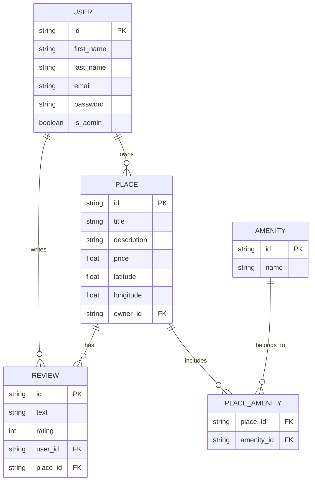

# HBnB Database Architecture & ER Diagram

## 📘 Overview
This document provides a visual and technical representation of the database schema for the **HBnB project**. It details the core entities, their attributes, and the relational connections between them using an Entity-Relationship (ER) diagram generated with [Mermaid.js](https://mermaid-js.github.io/mermaid/).

Visualizing these relationships is a crucial step in understanding the data flow and ensuring a robust persistence layer using SQLAlchemy.

---

## 🗄️ Entity-Relationship (ER) Diagram

The following diagram illustrates the schema for our core tables: `User`, `Place`, `Review`, `Amenity`, and the join table `Place_Amenity`.

---

## 📖 Entities Description

### 1. User
Represents the users of the application (both regular users and administrators).
- **Primary Key**: `id`
- **Key Attributes**: `email` (unique constraint), `password` (hashed).

### 2. Place
Represents the properties or listings created by users.
- **Primary Key**: `id`
- **Foreign Key**: `owner_id` (references `User.id`).

### 3. Review
Represents the feedback and ratings left by users for specific places.
- **Primary Key**: `id`
- **Foreign Keys**: `user_id` (references `User.id`), `place_id` (references `Place.id`).

### 4. Amenity
Represents the features or facilities available at a place (e.g., Wi-Fi, Pool, Air Conditioning).
- **Primary Key**: `id`

### 5. Place_Amenity (Join Table)
An association table required to handle the Many-to-Many relationship between places and amenities.
- **Foreign Keys**: `place_id` (references `Place.id`), `amenity_id` (references `Amenity.id`).

---

## 🔗 Understanding the Relationships

- **One-to-Many (`1:N`)**:
  - A **User** can own multiple **Places** (`USER ||--o{ PLACE`).
  - A **User** can write multiple **Reviews** (`USER ||--o{ REVIEW`).
  - A **Place** can have multiple **Reviews** (`PLACE ||--o{ REVIEW`).

- **Many-to-Many (`N:M`)**:
  - A **Place** can have multiple **Amenities**, and an **Amenity** can be associated with multiple **Places**. This complex relationship is resolved using the `PLACE_AMENITY` join table.
